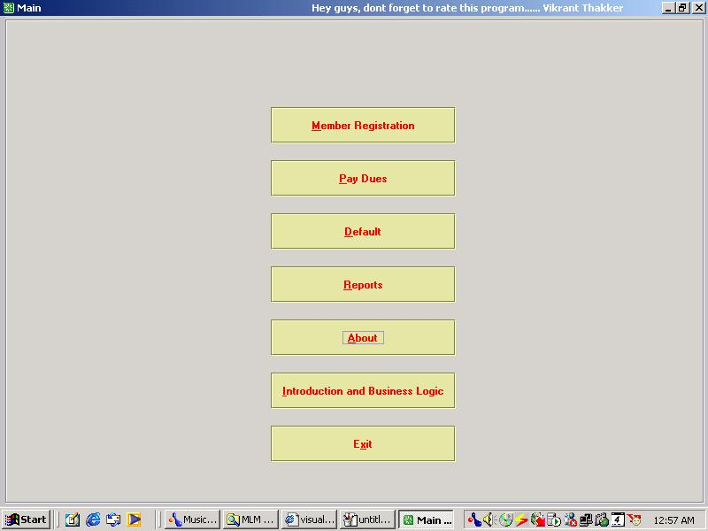



## Complete Multi\-Level\-Marketing \(MLM\) Software

### Description

This is an end-to-end software solution for companies in DIRECT MARKETING AREANA - MLM (Multi Level Marketing)

This caters to the requirement of profitability analysis. Customer Registration, incentive calculation and updation etc.

I would like to highlight the points, which are very specific to this software.

I basically have divided the entire operation into six modules :

I. 	Customer registration.

II. 	Network formation

III. 	Franchise sales and inventory tracking.

IV. 	Incentive calculation

V. 	Payment module

VI. 	Analytical Reports Generation
 
### More Info
 

             |
---                |---
**Submitted On**   |2002-09-02 16:05:26
**By**             |[Vikrant Thakker](https://github.com/Planet-Source-Code/PSCIndex/blob/master/ByAuthor/vikrant-thakker.md)
**Level**          |Intermediate
**User Rating**    |4.6 (120 globes from 26 users)
**Compatibility**  |VB 6\.0
**Category**       |[Complete Applications](https://github.com/Planet-Source-Code/PSCIndex/blob/master/ByCategory/complete-applications__1-27.md)
**World**          |[Visual Basic](https://github.com/Planet-Source-Code/PSCIndex/blob/master/ByWorld/visual-basic.md)
**Archive File**   |[Complete\_M126143932002\.zip](https://github.com/Planet-Source-Code/vikrant-thakker-complete-multi-level-marketing-mlm-software__1-38634/archive/master.zip)

